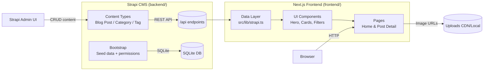

# Architecture Diagram

**Legend**

- Blue group (left): Strapi handles all CMS logic, authentication, and media.
- Purple group (right): Next.js fetches content server-side, renders React components, and delivers the blog experience.
- Double circles represent persisted storage (SQLite DB for content, upload directory or CDN for media).

